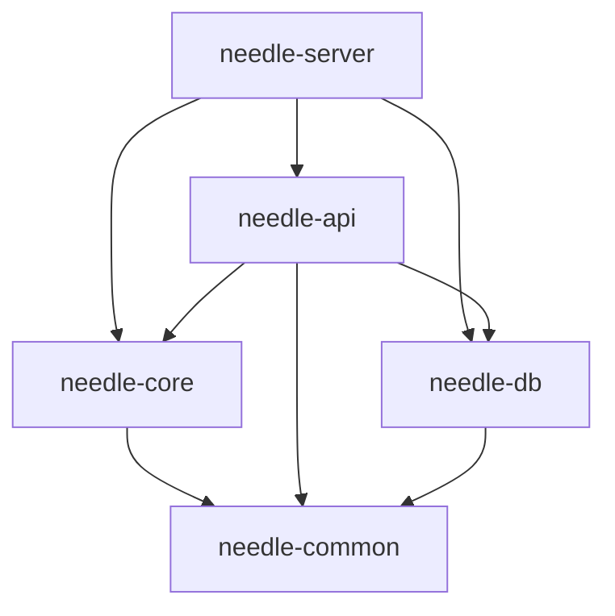

# Crate Overview

Detailed breakdown of Needle's 5 workspace crates and their internal structure.

## Workspace Structure

```
libneedle/
├── Cargo.toml              # Workspace root
├── Cargo.lock
└── crates/
    ├── needle-server/      # Binary crate
    ├── needle-core/        # Core logic
    ├── needle-api/         # REST API
    ├── needle-db/          # Database layer
    └── needle-common/      # Shared utilities
```

## Dependencies Between Crates



---

## needle-server

**Type**: Binary crate  
**Purpose**: Main entry point and service orchestration

### Module Structure

`src/main.rs` only - minimal code, delegates to libraries.

### Responsibilities

1. **Load Configuration**
   ```rust
   let config = NeedleConfig::from_env();
   ```

2. **Initialize Logging**
   ```rust
   tracing_subscriber::fmt()
       .with_env_filter(EnvFilter::from_default_env())
       .init();
   ```

3. **Start Services**
   - Spawn SSH server task
   - Spawn HTTP API server task
   - Spawn metrics server
   - Wait for shutdown signal

4. **Graceful Shutdown**
   - Listen for SIGINT/SIGTERM
   - Stop accepting new connections
   - Drain active connections
   - Exit cleanly

### Dependencies

```toml
[dependencies]
needle-core = { path = "../needle-core" }
needle-api = { path = "../needle-api" }
needle-db = { path = "../needle-db" }
tokio = { workspace = true }
tracing = { workspace = true }
```

---

## needle-core

**Type**: Library crate  
**Purpose**: SSH server, tunnel management, HTTP proxy

### Module Structure

```
src/
├── lib.rs              # Public API
├── config.rs           # Configuration
├── metrics.rs          # Prometheus metrics
├── ssh/
│   ├── mod.rs
│   ├── server.rs       # SSH server implementation
│   └── handler.rs      # SSH event handlers
├── tunnel/
│   ├── mod.rs
│   └── manager.rs      # Tunnel lifecycle
└── proxy/
    ├── mod.rs
    ├── http.rs         # HTTP/HTTPS proxy
    └── websocket.rs    # WebSocket proxy
```

### config.rs

**Export**: `NeedleConfig` struct

**Key Functions**:
- `NeedleConfig::from_env()` - Load and validate config
- `validate()` - Check all config constraints
- `tier_limit()` - Get tunnel limit for user tier

**Constants**:
- `DEFAULT_API_ADDR`, `DEFAULT_SSH_ADDR`, etc.

### ssh/server.rs

**Export**: `SshServer` struct

**Key Functions**:
- `new(host_key, tunnel_manager)` - Create SSH server
- `run(addr)` - Start listening on address

**Protocol Implementation**:
- Uses `russh::server::Handler` trait
- Handles: auth, channel requests, port forwarding

### ssh/handler.rs

**Implements**: SSH protocolhandlers

**Key Handlers**:
- `auth_publickey()` - Validate API key
- `tcpip_forward()` - Handle -R requests
- `channel_open_forwarded_tcpip()` - Forward connections

### tunnel/manager.rs

**Export**: `TunnelManager` struct

**Key Functions**:
- `create()` - Create new tunnel
- `remove()` - Delete tunnel
- `get()` - Lookup tunnel by subdomain
- `list()` - List all active tunnels

**State**:
- `active_tunnels: HashMap<String, Arc<Tunnel>>`
- `db_pool: PgPool`
- Rate limiting state

### proxy/http.rs

**Export**: `HttpProxy` struct

**Key Functions**:
- `handle_request()` - Reverse proxy for HTTP/HTTPS
- `forward_to_tunnel()` - Send request through SSH tunnel

**Features**:
- Read/write timeouts
- Request/response logging
- WebSocket upgrade support

### proxy/websocket.rs

**Export**: WebSocket handling functions

**Key Functions**:
- `upgrade()` - HTTP → WebSocket upgrade
- `proxy_frames()` - Bidirectional frame forwarding

---

## needle-api

**Type**: Library crate  
**Purpose**: REST API server

### Module Structure

```
src/
├── lib.rs              # Router setup
├── state.rs            # Shared state
├── middleware/
│   ├── mod.rs
│   ├── auth.rs         # JWT middleware
│   └── rate_limit.rs   # Rate limiting
└── routes/
    ├── mod.rs
    ├── auth.rs         # Login, register
    ├── tunnels.rs      # Tunnel CRUD
    ├── api_keys.rs     # API key management
    ├── analytics.rs    # Usage stats
    ├── inspector.rs    # Request logs
    ├── metrics.rs      # Prometheus export
    └── health.rs       # Health check
```

### lib.rs

**Export**: `create_router()` function

**Router Structure**:
```rust
let app = Router::new()
    .route("/health", get(health::check))
    .route("/metrics", get(metrics::export))
    .nest("/api", api_routes)
    .layer(cors_layer)
    .layer(trace_layer);
```

### state.rs

**Export**: `AppState` struct

**Fields**:
```rust
pub struct AppState {
    pub db: SupabaseClient,
    pub tunnel_manager: Arc<RwLock<TunnelManager>>,
    pub config: Arc<NeedleConfig>,
    pub domain: String,
}
```

### middleware/auth.rs

**Export**: `require_auth` middleware

**Key Functions**:
- `extract_token()` - Get JWT from Authorization header
- `validate_token()` - Verify signature and expiration
- Injects `Claims` extension into request

### routes/auth.rs

**Endpoints**:
- `POST /api/auth/register` - Create account
- `POST /api/auth/login` - Get JWT token

**Request/Response**:
```rust
// LoginRequest
{ "email": "...", "password": "..." }

// LoginResponse
{ "token": "jwt...", "user": {...} }
```

### routes/tunnels.rs

**Endpoints**:
- `GET /api/tunnels` - List user's tunnels
- `POST /api/tunnels` - Create tunnel (API alternative to SSH)
- `DELETE /api/tunnels/:id` - Delete tunnel

**Authorization**: Requires JWT, users can only access own tunnels

### routes/api_keys.rs

**Endpoints**:
- `GET /api/keys` - List user's API keys
- `POST /api/keys` - Generate new key
- `DELETE /api/keys/:id` - Revoke key

**Key Generation**:
- 32-byte random token
- Prefix: `needle_`
- Stored as SHA256 hash

---

## needle-db

**Type**: Library crate  
**Purpose**: Database abstraction layer

### Module Structure

```
src/
├── lib.rs              # Re-exports
├── client.rs           # Supabase client
├── models.rs           # Data structures
└── queries/
    ├── mod.rs
    ├── users.rs        # User CRUD
    ├── tunnels.rs      # Tunnel CRUD
    └── api_keys.rs     # API key CRUD
```

### client.rs

**Export**: `SupabaseClient` struct

**Methods**:
- `new(url, anon_key, service_key)`
- `get()`, `post()`, `patch()`, `delete()` - REST API wrappers

### models.rs

**Export**: Database models

**Key Structs**:
```rust
pub struct User {
    pub id: Uuid,
    pub email: String,
    pub username: String,
    pub password_hash: String,
    pub tier: String,
    pub created_at: DateTime<Utc>,
}

pub struct Tunnel {
    pub id: Uuid,
    pub user_id: Uuid,
    pub subdomain: String,
    pub target_port: i32,
    pub protocol: String,
    pub is_active: bool,
    pub is_persistent: bool,
    pub created_at: DateTime<Utc>,
}

pub struct ApiKey {
    pub id: Uuid,
    pub user_id: Uuid,
    pub name: String,
    pub key_hash: String,
    pub key_prefix: String,
    pub created_at: DateTime<Utc>,
    pub expires_at: Option<DateTime<Utc>>,
}
```

### queries/users.rs

**Exported Functions**:
- `find_by_email(db, email)` - Lookup user
- `find_by_id(db, id)` - Get user by ID
- `create(db, email, username, password_hash)` - Create user

### queries/tunnels.rs

**Exported Functions**:
- `find_by_user(db, user_id)` - List user's tunnels
- `find_by_subdomain(db, subdomain)` - Lookup tunnel
- `create(db, tunnel_data)` - Insert tunnel
- `update_status(db, subdomain, is_active)` - Activate/deactivate
- `delete(db, subdomain)` - Remove tunnel

---

## needle-common

**Type**: Library crate  
**Purpose**: Shared utilities

### Module Structure

```
src/
├── lib.rs              # Re-exports
├── error.rs            # Error types
├── subdomain.rs        # Subdomain helpers
└── rate_limit.rs       # Rate limiter
```

### error.rs

**Export**: `NeedleError` enum

**Variants**:
```rust
pub enum NeedleError {
    Database(String),
    Auth(String),
    Tunnel(String),
    RateLimit,
    InvalidInput(String),
}
```

**Conversions**:
- Implements `From<reqwest::Error>`
- Implements `From<serde_json::Error>`
- Implements `Into<(StatusCode, Json)>` for API responses

### subdomain.rs

**Exported Functions**:
- `is_valid_custom(subdomain)` - Validate format
- `generate_random()` - Create random 8-char subdomain
- `is_reserved(subdomain)` - Check against reserved list (www, api, etc.)

**Rules**:
- 3-63 characters
- Alphanumeric + hyphens
- Must start with letter
- Cannot end with hyphen

### rate_limit.rs

**Export**: `RateLimiter` struct

**Implementation**: Token bucket algorithm

**Methods**:
- `new(capacity, refill_rate)`
- `check(key)` - Returns `Ok(())` or `Err(RateLimitExceeded)`
- `reset(key)` - Clear bucket

**Usage**:
```rust
let limiter = RateLimiter::new(5, Duration::from_secs(60));
limiter.check(&ip_address)?;
```

---

## Shared Dependencies

All crates share these workspace dependencies:

```toml
[workspace.dependencies]
tokio = { version = "1", features = ["full"] }
serde = { version = "1", features = ["derive"] }
serde_json = "1"
uuid = { version = "1", features = ["v4", "serde"] }
chrono = { version = "0.4", features = ["serde"] }
tracing = "0.1"
thiserror = "2"
```

## Next Steps

- [Database Schema](./database-schema.md) - Table design
- [API Reference](./api-reference.md) - Endpoint documentation
- [Testing](./testing.md) - Test structure
- [Contributing](./contributing.md) - Development workflow
