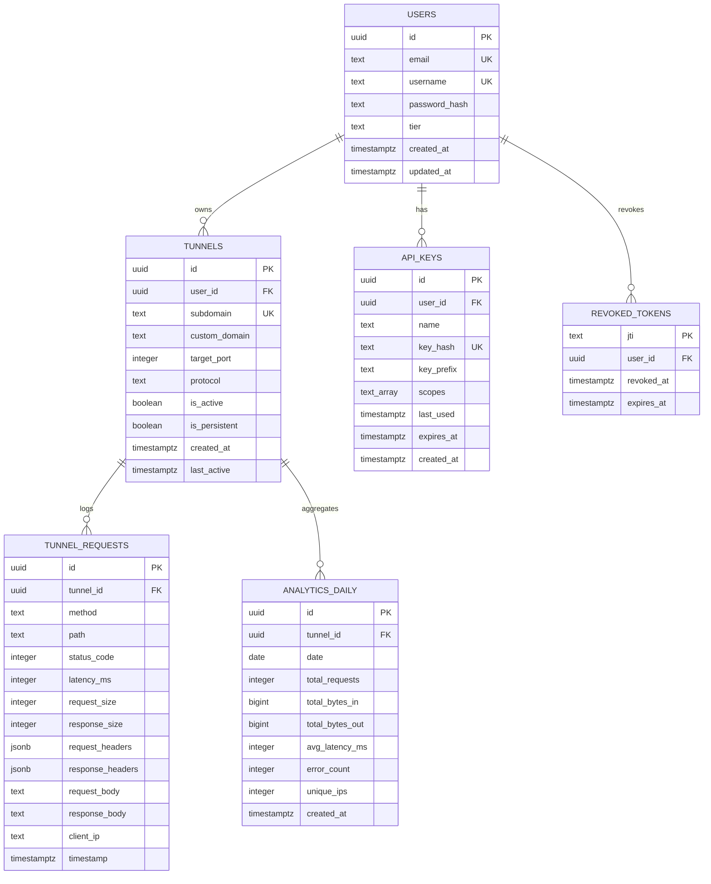

# Database Schema

Complete reference for Needle's PostgreSQL database schema.

## Entity Relationship Diagram



## Table Definitions

### users

Stores user account information. Authentication is handled via password hashing.

| Column | Type | Constraints | Description |
|--------|------|-------------|-------------|
| `id` | `uuid` | PRIMARY KEY, DEFAULT uuid_generate_v4() | Unique user identifier |
| `email` | `text` | UNIQUE, NOT NULL | Login email address |
| `username` | `text` | UNIQUE, NOT NULL | Unique username |
| `password_hash` | `text` | NOT NULL | Argon2 hashed password |
| `tier` | `text` | NOT NULL, DEFAULT 'free' | Subscription tier (free/pro/enterprise) |
| `created_at` | `timestamptz` | NOT NULL, DEFAULT now() | Account creation timestamp |
| `updated_at` | `timestamptz` | NOT NULL, DEFAULT now() | Last update timestamp |

**Indexes**:
- `idx_users_email ON (email)` - Fast email lookups for login
- `idx_users_username ON (username)` - Fast username lookups

**RLS Policy**: Users can only read/update their own row (`id = auth.uid()`)

### tunnels

Each row represents one tunnel mapping (subdomain → local port).

| Column | Type | Constraints | Description |
|--------|------|-------------|-------------|
| `id` | `uuid` | PRIMARY KEY | Unique tunnel identifier |
| `user_id` | `uuid` | FK → users(id), NOT NULL | Owner of the tunnel |
| `subdomain` | `text` | UNIQUE, NOT NULL | Subdomain (e.g., "abc123") |
| `custom_domain` | `text` | NULL | Custom domain (optional, pro tier) |
| `target_port` | `integer` | NOT NULL | Local port to forward to |
| `protocol` | `text` | NOT NULL, DEFAULT 'http' | Protocol (http/tcp/udp) |
| `is_active` | `boolean` | NOT NULL, DEFAULT false | Currently connected? |
| `is_persistent` | `boolean` | NOT NULL, DEFAULT false | Survives disconnects? |
| `created_at` | `timestamptz` | NOT NULL, DEFAULT now() | Tunnel creation time |
| `last_active` | `timestamptz` | NOT NULL, DEFAULT now() | Last traffic timestamp |

**Indexes**:
- `idx_tunnels_user_id ON (user_id)` - List user's tunnels
- `idx_tunnels_subdomain ON (subdomain)` - Fast subdomain lookups
- `idx_tunnels_active ON (is_active) WHERE is_active = true` - List active tunnels

**RLS Policy**: Users can only access tunnels where `user_id = auth.uid()`

### api_keys

Long-lived authentication tokens for SSH tunnel creation.

| Column | Type | Constraints | Description |
|--------|------|-------------|-------------|
| `id` | `uuid` | PRIMARY KEY | Unique key identifier |
| `user_id` | `uuid` | FK → users(id), NOT NULL | Key owner |
| `name` | `text` | NOT NULL | Descriptive name ("Laptop", "CI") |
| `key_hash` | `text` | UNIQUE, NOT NULL | SHA256 hash of the key |
| `key_prefix` | `text` | NOT NULL | First 8 chars (for display) |
| `scopes` | `text[]` | NOT NULL, DEFAULT '{tunnels:read, tunnels:write}' | Permissions |
| `last_used` | `timestamptz` | NULL | Last authentication timestamp |
| `expires_at` | `timestamptz` | NULL | Expiration (NULL = never) |
| `created_at` | `timestamptz` | NOT NULL, DEFAULT now() | Key generation time |

**Indexes**:
- `idx_api_keys_user_id ON (user_id)` - List user's keys
- `idx_api_keys_hash ON (key_hash)` - Fast key validation

**RLS Policy**: Users can only manage keys where `user_id = auth.uid()`

**Security**: Full key is never stored, only SHA256 hash. Prefix stored for UI display.

### tunnel_requests

Logs individual HTTP requests flowing through tunnels for traffic inspection.

| Column | Type | Constraints | Description |
|--------|------|-------------|-------------|
| `id` | `uuid` | PRIMARY KEY | Unique request identifier |
| `tunnel_id` | `uuid` | FK → tunnels(id), NOT NULL | Which tunnel |
| `method` | `text` | NOT NULL | HTTP method (GET, POST, etc.) |
| `path` | `text` | NOT NULL | Request path (/api/users) |
| `status_code` | `integer` | NOT NULL, DEFAULT 0 | HTTP status (200, 404, etc.) |
| `latency_ms` | `integer` | NOT NULL, DEFAULT 0 | Response time in milliseconds |
| `request_size` | `integer` | NOT NULL, DEFAULT 0 | Request body size in bytes |
| `response_size` | `integer` | NOT NULL, DEFAULT 0 | Response body size in bytes |
| `request_headers` | `jsonb` | NULL | HTTP request headers |
| `response_headers` | `jsonb` | NULL | HTTP response headers |
| `request_body` | `text` | NULL | Request body (truncated) |
| `response_body` | `text` | NULL | Response body (truncated) |
| `client_ip` | `text` | NULL | Source IP address |
| `timestamp` | `timestamptz` | NOT NULL, DEFAULT now() | When request occurred |

**Indexes**:
- `idx_tunnel_requests_tunnel_id ON (tunnel_id)` - List tunnel's requests
- `idx_tunnel_requests_timestamp ON (timestamp DESC)` - Recent requests first

**RLS Policy**: Users can read requests for their own tunnels only

**Performance**: This table grows quickly. Consider partitioning by date or TTL deletion.

### analytics_daily

Pre-aggregated daily statistics to avoid scanning `tunnel_requests` for charts.

| Column | Type | Constraints | Description |
|--------|------|-------------|-------------|
| `id` | `uuid` | PRIMARY KEY | Unique record identifier |
| `tunnel_id` | `uuid` | FK → tunnels(id), NOT NULL | Which tunnel |
| `date` | `date` | NOT NULL | Calendar date (UTC) |
| `total_requests` | `integer` | NOT NULL, DEFAULT 0 | Request count |
| `total_bytes_in` | `bigint` | NOT NULL, DEFAULT 0 | Uploaded bytes |
| `total_bytes_out` | `bigint` | NOT NULL, DEFAULT 0 | Downloaded bytes |
| `avg_latency_ms` | `integer` | NOT NULL, DEFAULT 0 | Average response time |
| `error_count` | `integer` | NOT NULL, DEFAULT 0 | 4xx and 5xx count |
| `unique_ips` | `integer` | NOT NULL, DEFAULT 0 | Unique clients |
| `created_at` | `timestamptz` | NOT NULL, DEFAULT now() | Aggregation timestamp |

**Unique Constraint**: `UNIQUE (tunnel_id, date)` - One record per tunnel per day

**Indexes**:
- `idx_analytics_daily_tunnel ON (tunnel_id, date DESC)` - Tunnel analytics over time

**RLS Policy**: Users can read analytics for their own tunnels

**Maintenance**: Run daily aggregation job via cron or background worker.

### revoked_tokens

Tracks JWT tokens that have been explicitly revoked (e.g., logout, security breach).

| Column | Type | Constraints | Description |
|--------|------|-------------|-------------|
| `jti` | `text` | PRIMARY KEY | JWT ID claim (unique per token) |
| `user_id` | `uuid` | FK → users(id), NOT NULL | Token owner |
| `revoked_at` | `timestamptz` | NOT NULL, DEFAULT now() | When revoked |
| `expires_at` | `timestamptz` | NOT NULL | Original expiration time |

**Indexes**:
- `idx_revoked_tokens_expires ON (expires_at)` - Cleanup expired entries
- `idx_revoked_tokens_user ON (user_id)` - User's revoked tokens

**RLS Policy**: Users can manage their own revoked tokens

**Maintenance**: Delete entries where `expires_at < now()` (they're already expired)

**Note**: Currently not implemented. JWT revocation requires checking this table on every API request, which adds latency.

## Row-Level Security

All tables have RLS enabled. Policies ensure users can only access their own data.

Example policy on `tunnels`:

```sql
CREATE POLICY "tunnels_owner_access" ON tunnels
    FOR ALL USING (user_id = auth.uid());
```

This means:
- `SELECT` only returns rows where `user_id` matches authenticated user
- `INSERT` only allowed if `user_id` matches authenticated user
- `UPDATE`/`DELETE` only allowed for owned rows

## Triggers

### Auto-Update `updated_at`

The `users` table has a trigger to automatically update `updated_at` on modification:

```sql
CREATE TRIGGER users_updated_at
    BEFORE UPDATE ON users
    FOR EACH ROW
    EXECUTE FUNCTION update_updated_at();
```

Function definition:

```sql
CREATE OR REPLACE FUNCTION update_updated_at()
RETURNS TRIGGER AS $$
BEGIN
    NEW.updated_at = now();
    RETURN NEW;
END;
$$ LANGUAGE plpgsql;
```

## Migration Strategy

Currently, there is **no migration system**. Schema changes require manual SQL execution.

**Future**: Implement migrations using:
- `sqlx-cli` for versioned migrations
- Or `refinery` crate for embedded migrations

**Current process**:
1. Edit `schema.sql`
2. Apply changes manually in production
3. Document breaking changes in `CHANGELOG.md`

## Performance Considerations

### Indexes

All foreign keys have indexes for fast joins. Additional indexes on commonly queried columns (email, subdomain, timestamp).

### Query Patterns

**Fast queries**:
- Find user by email: O(log n) via index
- Find tunnel by subdomain: O(log n) via index
- List user's tunnels: O(k) where k = user's tunnel count

**Slow queries** (needs optimization):
- Full-text search on request bodies
- Aggregations across all requests (use `analytics_daily` instead)

### Partitioning

For high-traffic deployments, consider partitioning:
- `tunnel_requests` by `timestamp` (monthly partitions)
- `analytics_daily` by `date` (yearly partitions)

## Data Retention

Recommended retention policies:

| Table | Retention | Rationale |
|-------|-----------|-----------|
| `users` | Indefinite | Core data |
| `tunnels` | 90 days after deletion | Audit trail |
| `api_keys` | 90 days after revocation | Audit trail |
| `tunnel_requests` | 30 days | Inspection use only |
| `analytics_daily` | 1 year | Historical analytics |
| `revoked_tokens` | 1 day after expiration | No longer needed |

Implement with cron jobs:

```sql
-- Delete old requests
DELETE FROM tunnel_requests WHERE timestamp < now() - INTERVAL '30 days';

-- Delete expired revoked tokens
DELETE FROM revoked_tokens WHERE expires_at < now() - INTERVAL '1 day';
```

## Next Steps

- [API Reference](./api-reference.md) - How to interact with this data
- [Testing](./testing.md) - Database testing strategies
- [Contributing](./contributing.md) - Schema change process
