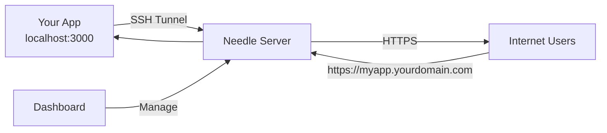

# Introduction

Welcome to **Needle**, a high-performance SSH tunneling service that exposes your local applications to the internet through memorable subdomains with automatic SSL termination.

## What is Needle?

Needle is a self-hosted alternative to services like ngrok and tunnl.gg, designed for developers who need to:

- **Expose local development servers** to the internet for testing webhooks, OAuth callbacks, or mobile app backends
- **Share work-in-progress** with clients or teammates without deploying to staging
- **Debug production issues** by creating temporary tunnels to reproduce problems locally
- **Demo applications** running on your laptop at conferences or meetings

## Key Features

- **🚀 High Performance**: Built with Rust for minimal latency and maximum throughput
- **🔒 Secure by Default**: Automatic HTTPS with Let's Encrypt, JWT authentication, and row-level security
- **🎯 Custom Subdomains**: Reserve memorable subdomains (pro feature) or get random ones (free)
- **📊 Real-time Analytics**: Track requests, bandwidth, and errors through the web dashboard
- **🔍 Traffic Inspection**: View and replay HTTP requests for debugging
- **♾️ Persistent Tunnels**: Tunnels survive disconnections and can be configured to auto-reconnect
- **⚡ WebSocket Support**: Full bidirectional communication with built-in rate limiting
- **🎨 Modern Dashboard**: Vue.js-based UI with live updates and Dark Everblush theme

## How It Works

1. **You run your app locally** (e.g., on `localhost:3000`)
2. **Create an SSH tunnel** to the Needle server using your API key
3. **Needle assigns a subdomain** (e.g., `myapp.yourdomain.com`)
4. **Traffic is forwarded** from the public URL to your local app
5. **Monitor everything** in real-time through the web dashboard

## Use Cases

### Webhook Development
Test Stripe, GitHub, or Twilio webhooks against your local development environment without deploying.

### OAuth Integration
Configure OAuth callbacks to point to your tunnel URL during development, avoiding the need for localhost workarounds.

### Mobile App Testing
Point your mobile app to a tunnel URL to test against your local backend without being on the same network.

### Client Demos
Show clients your work without deploying to a staging server or sharing your screen.

### IoT Device Testing
Configure IoT devices to communicate with your local development server through a public endpoint.

## Architecture

Needle consists of two main components:

- **`libneedle`** - Rust backend with 5 crates:
  - `needle-server` - Main binary and startup logic
  - `needle-core` - SSH server, tunnel manager, HTTP/WebSocket proxy
  - `needle-api` - REST API for tunnel management
  - `needle-db` - Supabase/PostgreSQL integration
  - `needle-common` - Shared utilities and error types

- **`needleui`** - Vue.js 3 + TypeScript dashboard:
  - Tunnel management interface
  - Real-time traffic inspection
  - Analytics and charts
  - API key management

## Technology Stack

| Component | Technology |
|-----------|------------|
| Backend Language | Rust (Edition 2024) |
| Async Runtime | Tokio |
| SSH Server | russh |
| HTTP Server | Axum + Tower |
| Database | PostgreSQL (via Supabase) |
| Authentication | JWT + OAuth |
| Frontend Framework | Vue 3 + TypeScript |
| Build Tool | Vite |
| State Management | Pinia |

## Comparison with Alternatives

| Feature | Needle | ngrok | tunnl.gg |
|---------|--------|-------|----------|
| Self-hosted | ✅ Yes | ❌ No | ❌ No |
| Open Source | ✅ MIT | ❌ Proprietary | ❌ Proprietary |
| Custom Subdomains | ✅ Yes (paid) | ✅ Yes (paid) | ❌ Random only |
| Traffic Inspection | ✅ Persistent | ✅ Live only | ❌ No |
| WebSocket Support | ✅ Yes | ✅ Yes | ✅ Yes |
| API Management | ✅ Full REST API | ⚠️ Limited | ❌ No API |
| Tier Limits | ✅ Configurable | ⚠️ Fixed | ⚠️ Fixed |
| Persistent Tunnels | ✅ Yes | ✅ Yes (paid) | ❌ No |

## License

Needle is released under the **MIT License**, allowing you to use, modify, and distribute it freely for both personal and commercial projects.

---

## Next Steps

- **New Users**: Start with the [Quick Start](./quick-start.md) guide
- **Developers**: Read the [Architecture](./developer-guide/architecture.md) overview
- **Operators**: Check the [Deployment](./operations/deployment.md) guide
