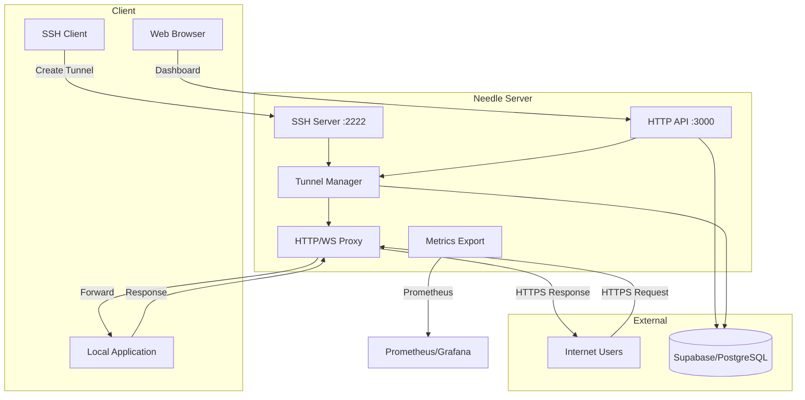
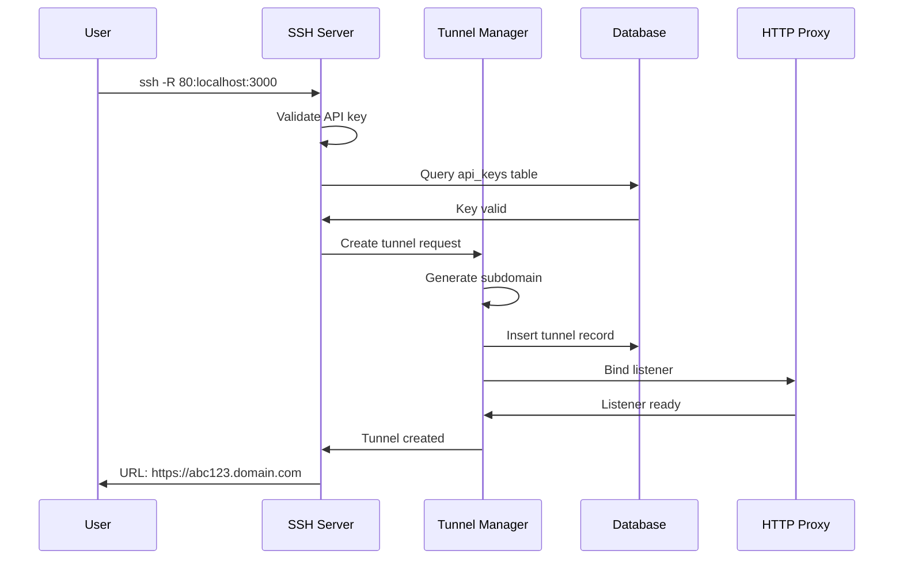
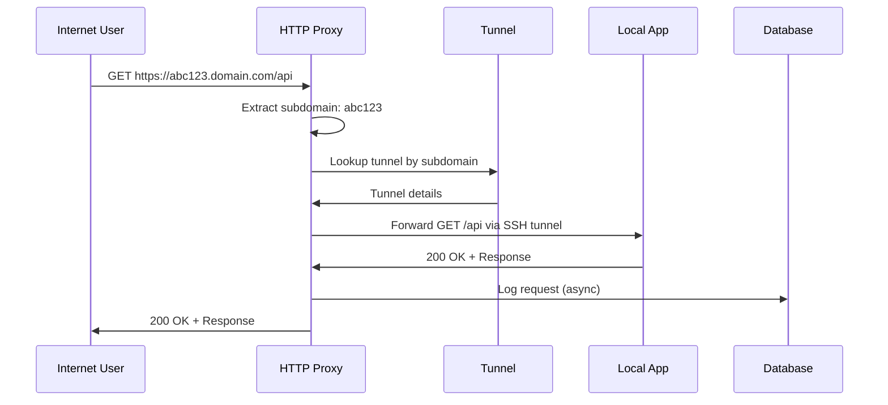

# Architecture

Understand Needle's system design, component structure, and technology choices.

## High-Level Architecture



## Component Breakdown

Needle is organized as a Rust workspace with 5 crates:

### needle-server
**Purpose**: Main binary and entry point

**Responsibilities**:
- Parse command-line arguments
- Load configuration from environment
- Initialize all services
- Set up logging and tracing
- Graceful shutdown handling

**Key Files**:
- `main.rs` - Entry point, service orchestration

### needle-core
**Purpose**: Core business logic for SSH and HTTP proxying

**Modules**:
- `config` - Configuration structure and validation
- `ssh/` - SSH server implementation using `russh`
- `tunnel/` - Tunnel lifecycle management
- `proxy/` - HTTP and WebSocket reverse proxy
- `metrics` - Prometheus metrics collection

**Key Files**:
- `ssh/server.rs` - SSH server using russh
- `ssh/handler.rs` - SSH event handling (auth, port forwarding)
- `tunnel/manager.rs` - Tunnel creation, deletion, state management
- `proxy/http.rs` - HTTP/HTTPS reverse proxy with timeouts
- `proxy/websocket.rs` - WebSocket upgrade and forwarding

**Dependencies**:
- `russh` - SSH protocol implementation
- `hyper` - HTTP client/server
- `tokio-tungstenite` - WebSocket support

### needle-api
**Purpose**: REST API and web dashboard backend

**Modules**:
- `routes/` - API endpoint handlers
- `middleware/` - Authentication, rate limiting, CORS
- `state` - Shared application state

**Routes**:
- `/api/auth/*` - Authentication (login, register)
- `/api/tunnels` - Tunnel management
- `/api/keys` - API key management
- `/api/analytics/*` - Usage statistics
- `/health` - Health check endpoint
- `/metrics` - Prometheus metrics

**Dependencies**:
- `axum` - Web framework
- `tower-http` - HTTP middleware (CORS, logging)
- `jsonwebtoken` - JWT token generation/validation

### needle-db
**Purpose**: Database abstraction layer

**Modules**:
- `client` - Supabase REST API client
- `models` - Data structures (User, Tunnel, ApiKey, etc.)
- `queries/` - CRUD operations for each model

**Tables**:
- `users` - User accounts
- `tunnels` - Tunnel configuration and state
- `api_keys` - Authentication keys
- `tunnel_requests` - HTTP request logs
- `analytics_daily` - Pre-aggregated statistics
- `revoked_tokens` - JWT blacklist (planned)

**Dependencies**:
- `reqwest` - HTTP client for Supabase REST API
- `serde` - Serialization/deserialization

### needle-common
**Purpose**: Shared utilities and types

**Modules**:
- `error` - Error types and conversions
- `subdomain` - Subdomain generation and validation
- `rate_limit` - Token bucket rate limiter

**Used by**: All other crates

## Data Flow

### Tunnel Creation Flow



### HTTP Request Flow



## Technology Stack

### Backend

| Technology | Version | Purpose |
|------------|---------|---------|
| **Rust** | 1.80+ | Systems programming language |
| **Tokio** | 1.x | Async runtime |
| **Axum** | 0.8 | Web framework |
| **russh** | 0.46 | SSH protocol |
| **Hyper** | 1.x | HTTP client/server |
| **tokio-tungstenite** | 0.26 | WebSocket support |

### Frontend

| Technology | Version | Purpose |
|------------|---------|---------|
| **Vue.js** | 3.x | UI framework |
| **TypeScript** | 5.x | Type safety |
| **Vite** | 6.x | Build tool |
| **Pinia** | 2.x | State management |

### Database

| Technology | Purpose |
|------------|---------|
| **PostgreSQL** | 14+ via Supabase |
| **Row-Level Security** | Multi-tenant isolation |

## Concurrency Model

Needle uses Tokio's async runtime for high concurrency:

- **One task per SSH connection**
- **One task per HTTP proxy listener**
- **One task per active HTTP request**
- **Background task for metrics collection**

Shared state is protected with:
- `Arc<RwLock<T>>` for tunnel manager
- `Arc<T>` for read-only config
- Async-aware locks to prevent blocking

## Security Architecture

### Authentication Layers

1. **API Keys** - SSH tunnel auth
   - Stored as SHA256 hash in database
   - 32-byte random tokens
   - Per-user, revocable

2. **JWT Tokens** - HTTP API auth
   - Signed with `JWT_SECRET`
   - 24-hour expiration
   - Contains user ID, email, tier

3. **Row-Level Security** - Database layer
   - Supabase RLS policies
   - Users can only access own data
   - Enforced at database level

### Network Security

- **HTTPS Only** - All tunnel traffic over TLS
- **SSH Tunnel Encryption** - End-to-end encrypted forwarding
- **CORS** - Configurable origin restrictions
- **Rate Limiting** - Per-IP and per-user

## Scalability Considerations

### Current Limits

- **Single-server** architecture (no clustering)
- **In-memory** tunnel state (lost on restart)
- **PostgreSQL** can handle ~10K concurrent connections
- **Rust async** supports millions of concurrent tasks

### Future Scaling

Planned enhancements:
- **Redis** for distributed tunnel state
- **Load balancing** across multiple servers
- **Horizontal scaling** with shared state
- **CDN integration** for static assets

## Configuration Management

Configuration follows this precedence (highest to lowest):

1. **Environment variables** - Runtime configuration
2. **Default values** - Hardcoded fallbacks in `config.rs`
3. **No config files** - Simplified deployment

Validation occurs at startup:
- ❌ Invalid config → Panic with clear error
- ✅ Valid config → Log configuration summary

## Error Handling

### Error Types

```rust
#[derive(Debug, thiserror::Error)]
pub enum NeedleError {
    #[error("database error: {0}")]
    Database(String),
    
    #[error("authentication failed: {0}")]
    Auth(String),
    
    #[error("tunnel error: {0}")]
    Tunnel(String),
    
    #[error("rate limit exceeded")]
    RateLimit,
}
```

### Error Propagation

- Use `?` operator for error propagation
- Convert to HTTP status codes in API handlers
- Log all errors with context (`tracing::error!`)
- Never expose internal errors to clients

## Observability

### Logging

- **Structured logs** via `tracing` crate
- **Log levels**: error, warn, info, debug, trace
- **Context**: All logs include span context (user_id, tunnel_id, etc.)

### Metrics

Prometheus metrics exported at `/metrics`:
- `needle_tunnels_active` - Active tunnel count
- `needle_http_requests_total` - Total HTTP requests
- `needle_http_request_duration_seconds` - Latency histogram
- `needle_auth_failures_total` - Failed auth attempts
- `needle_errors_total` - Error count by type

## Testing Strategy

### Unit Tests
- Configuration validation
- Subdomain generation
- Rate limiting logic
- Error type conversions

### Integration Tests
- Full tunnel lifecycle
- API endpoint testing
- Database operations
- Authentication flows

### Performance Tests
- Concurrent tunnel creation
- HTTP proxy throughput
- WebSocket scalability

## Next Steps

- [Crate Overview](./crate-overview.md) - Detailed breakdown of each crate
- [Database Schema](./database-schema.md) - Data model design
- [API Reference](./api-reference.md) - Complete API documentation
- [Contributing](./contributing.md) - Development guidelines
