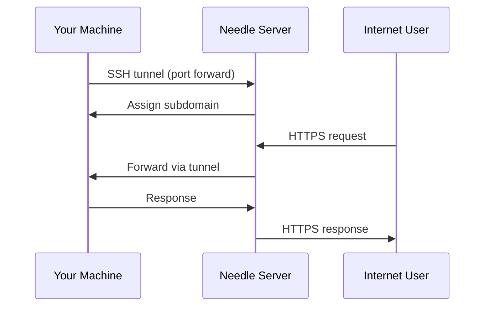

# Creating Tunnels

Learn how to create and manage SSH tunnels to expose your local applications to the internet.

## Overview

Needle tunnels work by establishing an SSH connection from your machine to the Needle server, which then forwards incoming HTTP/HTTPS traffic to your local application.



## Prerequisites

Before creating your first tunnel:

1. **Needle server is running** at your domain
2. **You have an API key** (create one in the dashboard under Settings → API Keys)
3. **SSH client installed** on your machine (OpenSSH, PuTTY, etc.)
4. **Local application running** (e.g., on `localhost:3000`)

## Basic Tunnel Creation

### Using SSH Command Line

The basic syntax is:

```bash
ssh -R [remote:]remote_port:local_host:local_port \
    tunnel@your-domain.com \
    -p 2222 \
    -o "User=needle_YOUR_API_KEY"
```

**Example:** Expose local app on port 3000

```bash
ssh -R 80:localhost:3000 \
    tunnel@yourdomain.com \
    -p 2222 \
    -o "User=needle_abc123xyz456"
```

Output:

```
Tunnel created successfully
URL: https://xyz789.yourdomain.com
Forwarding: https://xyz789.yourdomain.com → localhost:3000
```

### Understanding the Parameters

| Parameter | Description | Example |
|-----------|-------------|---------|
| `-R 80:localhost:3000` | Remote port 80 → local port 3000 | Forward HTTP traffic |
| `tunnel@yourdomain.com` | SSH server address | Your Needle domain |
| `-p 2222` | SSH server port | Default is 2222 |
| `-o "User=needle_..."` | API key for authentication | Your API key |

## Custom Subdomains

> [!NOTE]
> Custom subdomains require a **Pro** or **Enterprise** tier subscription.

### Request Specific Subdomain

```bash
ssh -R myapp:80:localhost:3000 \
    tunnel@yourdomain.com \
    -p 2222 \
    -o "User=needle_YOUR_API_KEY"
```

This creates: `https://myapp.yourdomain.com`

### Subdomain Rules

- **3-63 characters** (alphanumeric and hyphens only)
- **Must start with a letter**
- **Cannot end with a hyphen**
- **Unique** across all users

Valid examples:
- `my-app`
- `staging-v2`
- `client-demo`

Invalid examples:
- `my_app` (no underscores)
- `-myapp` (can't start with hyphen)
- `ab` (too short)

## Advanced Tunnel Types

### WebSocket Tunnels

WebSockets work automatically with HTTP tunnels:

```bash
# Your local WebSocket server on port 8080
ssh -R 80:localhost:8080 \
    tunnel@yourdomain.com \
    -p 2222 \
    -o "User=needle_YOUR_API_KEY"
```

The tunnel URL will support both HTTP and WebSocket connections.

### Multiple Tunnels

Create multiple tunnels in separate terminal sessions:

Terminal 1:
```bash
ssh -R 80:localhost:3000 \
    tunnel@yourdomain.com -p 2222 \
    -o "User=needle_YOUR_API_KEY"
```

Terminal 2:
```bash
ssh -R 80:localhost:8080 \
    tunnel@yourdomain.com -p 2222 \
    -o "User=needle_YOUR_API_KEY"
```

Each tunnel gets its own unique subdomain.

### Persistent Tunnels

> [!TIP]
> Use persistent tunnels for long-running services that need to survive disconnections.

Enable persistence (Pro/Enterprise tiers):

```bash
ssh -R 80:localhost:3000 \
    tunnel@yourdomain.com -p 2222 \
    -o "User=needle_YOUR_API_KEY" \
    -o "ServerAliveInterval=60" \
    -o "ServerAliveCountMax=3"
```

These options:
- `ServerAliveInterval=60` - Send keepalive every 60 seconds
- `ServerAliveCountMax=3` - Disconnect after 3 missed keepalives

## Using SSH Config File

For convenience, add to `~/.ssh/config`:

```ssh-config
Host needle
    HostName yourdomain.com
    Port 2222
    User needle_YOUR_API_KEY
    ServerAliveInterval 60
    ServerAliveCountMax 3
```

Then create tunnels with:

```bash
ssh -R 80:localhost:3000 needle
```

## Tunnel Management

### View Active Tunnels

**Via Dashboard:**
- Log in to the web dashboard
- View all active tunnels on the homepage

**Via API:**
```bash
curl -H "Authorization: Bearer YOUR_JWT_TOKEN" \
     https://yourdomain.com/api/tunnels
```

### Stop a Tunnel

Press `Ctrl+C` in the terminal where the SSH tunnel is running.

Or use the dashboard:
1. Go to **Tunnels** page
2. Find your tunnel
3. Click **Stop** button

### Delete a Tunnel

Deleting a tunnel permanently removes it from your account:

```bash
curl -X DELETE \
     -H "Authorization: Bearer YOUR_JWT_TOKEN" \
     https://yourdomain.com/api/tunnels/TUNNEL_ID
```

## Tunnel Limits

Limits vary by tier:

| Tier | Concurrent Tunnels | Custom Subdomains | Persistent |
|------|-------------------|-------------------|------------|
| Free | 3 | ❌ No | ❌ No |
| Pro | 50 | ✅ Yes | ✅ Yes |
| Enterprise | 500 | ✅ Yes | ✅ Yes |

You'll also be limited by:
- **Per-IP limit**: Default 5 tunnels (configurable by admin)
- **Global limit**: Default 1000 total active tunnels (configurable)

## Traffic Inspection

View traffic flowing through your tunnels in the dashboard:

1. Go to **Tunnels** → Select your tunnel
2. Click **Inspector** tab
3. See real-time requests and responses

Features:
- **Request/Response headers**
- **Request/Response bodies**
- **Latency metrics**
- **Status codes**
- **Replay requests** to debug

## Security Considerations

### HTTPS Everywhere

All tunnel URLs use HTTPS with automatic SSL certificates. Your local app can still use HTTP - Needle handles SSL termination.

### API Key Security

> [!CAUTION]
> Treat API keys like passwords!

- **Never commit** API keys to git
- **Rotate keys** regularly from the dashboard
- **Use separate keys** for different environments
- **Revoke compromised keys** immediately

### Rate Limiting

Tunnels are protected by rate limiting:
- **Per tunnel**: Configured by admin
- **Per user**: Based on tier
- **Per IP**: Prevents abuse

If you hit rate limits, you'll see HTTP 429 responses.

## Examples

### Expose Local Web Server

```bash
# Start your app
cd my-app
npm run dev  # Running on localhost:3000

# Create tunnel
ssh -R 80:localhost:3000 \
    tunnel@yourdomain.com -p 2222 \
    -o "User=needle_YOUR_API_KEY"
```

### Webhook Testing (Stripe)

```bash
# Start your webhook handler
python app.py  # Listening on localhost:5000

# Create tunnel
ssh -R 80:localhost:5000/webhooks \
    tunnel@yourdomain.com -p 2222 \
    -o "User=needle_YOUR_API_KEY"

# Configure Stripe webhook URL
# → https://xyz789.yourdomain.com/webhooks
```

### Mobile App Backend

```bash
# Start backend API
./api-server --port 8080

# Create custom subdomain tunnel (Pro tier)
ssh -R mobile-api:80:localhost:8080 \
    tunnel@yourdomain.com -p 2222 \
    -o "User=needle_YOUR_API_KEY"

# Point your mobile app to:
# https://mobile-api.yourdomain.com
```

### SSH Over Tunnel (Advanced)

```bash
# Expose your own SSH server
ssh -R 22:localhost:22 \
    tunnel@yourdomain.com -p 2222 \
    -o "User=needle_YOUR_API_KEY"

# Others can SSH to your machine via:
# ssh user@xyz789.yourdomain.com -p 22
```

## Troubleshooting

### "Authentication failed"

- Verify API key is correct (check dashboard)
- Ensure API key hasn't expired
- Check you're using the right user format: `needle_YOUR_API_KEY`

### "Subdomain already in use"

- Try a different subdomain name
- Check if you already have a tunnel with that name
- Custom names must be unique across all users

### "Connection refused" from tunnel URL

- Verify your local app is actually running
- Check you used the correct local port
- Ensure no firewall blocking localhost access

### "Rate limit exceeded"

- Wait a few minutes for limits to reset
- Check your tier limits in dashboard
- Contact admin to increase limits if needed

### Tunnel keeps disconnecting

- Add keepalive options (ServerAliveInterval)
- Check your network stability
- Upgrade to persistent tunnels (Pro tier)

## Next Steps

- [Web Dashboard](./dashboard.md) - Manage tunnels via web interface
- [Configuration](./configuration.md) - Advanced configuration options
- [API Reference](../developer-guide/api-reference.md) - Programmatic tunnel management
